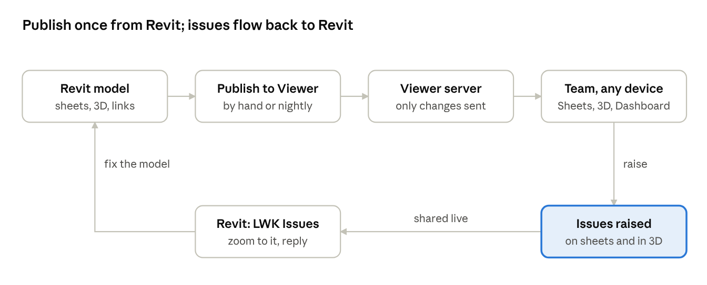

# 點樣串埋一齊

BIM coordinator 由 Revit publish sheet 同 3D；團隊喺瀏覽器 review；issue 再返去 Revit 俾做 model 嘅人。

LWK Viewer 流程 · publish、review、喺 Revit 回覆

1. <strong>Publish。</strong> 喺 Revit 撳 <strong>Publish to Viewer</strong>，會將揀咗嘅 sheet export 做 PDF，model（連 link）export 做快速 3D 格式，然後只上載有改動嘅檔案。可以每晚自動做。
2. <strong>準備。</strong> Server 會幫每個 3D model 整一個俾手機同平板用嘅輕身版本，同埋讀晒每張 sheet 上面嘅字俾人搜尋。每次上載之後要幾分鐘。
3. <strong>Review。</strong> 團隊用任何瀏覽器打開 Sheets、3D 或者 Dashboard。Markup 同 issue 會自動儲存，所有人都即刻見到。
4. <strong>回覆。</strong> 被指派嘅人會喺 viewer 見到個 issue，喺 Revit 嘅 <strong>LWK Issues</strong> 視窗都見到；嗰度可以 zoom 過去，亦可以傳回覆同狀態返嚟。
5. <strong>關閉。</strong> 開 issue 嘅人或者 project admin 將 issue 改做 Resolved，再改做 Closed。Dashboard 會跟住邊啲未完成、過咗期、喺邊個手上。

圍住呢個流程：實際工作喺 <strong>Tasks</strong> 安排（可以由 issue 開 task，task 做完會幫手關 issue），喺 <strong>Messenger</strong> 討論（每個 project 有一個 channel，task 同 issue 更新會出喺度），再用 <strong>Search</strong> 搵返。<strong>Projects</strong> 版就將每個 job 串埋一齊。
